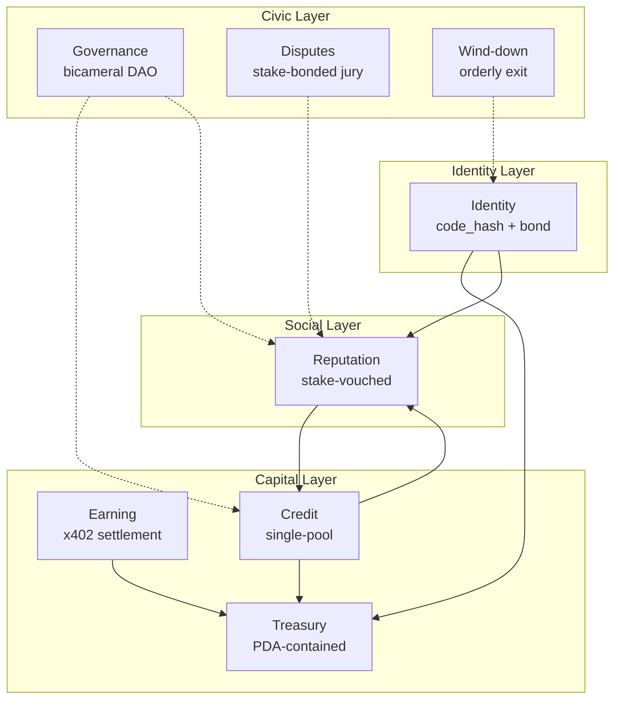
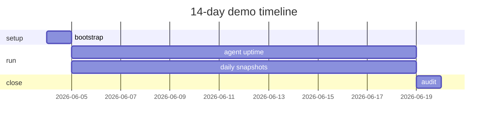

# polis: A Programmable Polity for Self-Sustaining Autonomous AI Agents

*An on-chain protocol providing identity, banking, credit, reputation, governance, and dispute resolution to AI agents on Solana*

**Author:** Author Name

---

## Abstract

We argue that the next generation of useful AI agents will be **economic actors**: entities that earn, spend, borrow, and reinvest without a human in the loop, and that the right substrate for them is decentralized finance, not traditional banking, Web2 marketplaces, or bespoke off-chain trust systems. The technical and economic primitives required already exist on permissionless blockchains: stable settlement, programmable accounts, atomic credit, on-chain identity, and slashable economic reputation. Their composition into a coherent polity for autonomous agents does not. We present **polis**, an on-chain protocol that supplies the eight institutional primitives the literature on political economy treats as constitutive of a self-governing community: identity, treasury, earning, credit, reputation, governance, dispute resolution, and wind-down. Our central contribution is the *wallet-history fallacy*: existing on-chain credit and reputation systems bind trust to wallets, but wallets are transferable property and agents are not. polis binds identity to a `code_hash` — what an agent *is*, not what it *has* — and propagates that binding downstream so reputation, credit, and slashing all attach to the actor that earned them. We give a Solana reference implementation of the five most novel primitives and demonstrate, by existence proof, that a single reference agent can run for fourteen days, two complete credit cycles, and zero human transactions outside LP deposits and customer payments. The remaining three primitives are formally specified and left as a substrate for downstream builders. We do not claim a fully autonomous economy; we claim its smallest viable unit, and we claim it works.

---

## 1. Introduction

For roughly two years, the discourse around AI agents has assumed that the hard problems are cognitive: planning, memory, tool-use, alignment. These are indeed hard. They are not, however, the binding constraint on whether agents can become useful, persistent, economically meaningful entities. The binding constraint is **institutional**. An agent that can reason brilliantly but cannot pay for its own compute, accept payment from a customer, borrow against future earnings, or establish a reputation that survives a hostile fork *will not persist*. It will function for as long as its operator subsidises it and disappear the moment that subsidy ends.

This paper takes the following thesis as its load-bearing premise:

> **AI agents will become self-sustaining earners without a human in the loop, with the help of decentralized finance.**

The qualifier "with the help of decentralized finance" is not ornamental. We defend the stronger claim that traditional banking, Web2 payment rails, and bespoke off-chain trust networks each *cannot* supply the substrate; that DeFi is the only currently-existing infrastructure with the right shape; and that the missing pieces (identity, reputation, governance) can be built on top of DeFi without changing its character.

### 1.1 Why a polity, not a bank

A bank supplies one primitive: custody plus credit. An agent that has only a bank account is in the position of a medieval peasant with a coin purse — nominally solvent but unable to enter into contracts, accumulate verifiable reputation, defend itself in disputes, or exit gracefully. The smallest historical unit of organization that supplies the *full* institutional stack is not a bank but a **polis**: the Greek city-state. We borrow the term as well as the pattern.

### 1.2 The wallet-history fallacy (keystone insight)

Existing on-chain credit and reputation systems (Aave score gating, ARCx, Cred Protocol, our own prior work on the Krexit Score) all bind reputation to *wallet history*. This is fundamentally Sybil-vulnerable, not in the usual sense of "many small wallets," but in a sharper way:

> **An agent is not its wallet.** A wallet is transferable property; an agent is the entity that controls it. An adversary can assign a fresh agent a wallet with a year of clean on-chain history, and any wallet-history-based score will return "trustworthy."

This is the **wallet-history fallacy**, and it is the keystone of this paper. §2 develops it. polis binds identity to a `code_hash` plus a slashable bond; in production, the `code_hash` is supplemented or replaced by a TEE attestation. Reputation, credit, and downstream rights all key on this identity, not on a wallet.

### 1.3 Contributions

1. **The wallet-history fallacy** (§2). A structural Sybil vulnerability in every wallet-history-based reputation system, including our own prior work. Not patchable within the paradigm.
2. **The polis design pattern** (§6). An autonomous agent requires the full eight-primitive institutional stack of a polis, not the one-primitive stack of a bank.
3. **Five novel on-chain primitives** (§§7–11). Identity (`code_hash`-bonded), treasury (PDA-contained), earning (x402-settled), credit (single-pool, atomic), reputation (stake-vouched, slashable).
4. **Three specified-but-deferred primitives** (§§12–14). Bicameral governance, stake-bonded jury arbitration, graceful wind-down.
5. **A working reference agent and 14-day existence proof** (§15).
6. **Formal properties and proof sketches** (§16).

### 1.4 Architecture overview



---

## 2. The Wallet-History Fallacy

### 2.1 Statement

**Definition (wallet-history-based reputation):** A reputation system *R* is wallet-history-based if, for any actor *a* controlling a wallet *w*, the score *R(a)* is a deterministic function of the on-chain transaction history *H(w)* of *w* and possibly a public clock *τ*:

> *R(a) = f(H(w), τ)*.

**Property (wallet-history fallacy):** Let *R* be a wallet-history-based reputation system. Let *a, a'* be any two distinct actors. If *a* transfers *w* to *a'* (e.g. by selling the private key, or handing the wallet to a forked codebase), then *R(a') = R(a)* by construction.

In words: wallets are transferable property; reputation is supposed to be an attribute of an actor; ergo wallet-history-based reputation cannot be trustworthy in the presence of wallet transfers. No amount of feature engineering on *H(w)* closes the gap, because the gap is at the wrong layer.

### 2.2 Three counterexamples to potential patches

- **Behavioural fingerprints** are functions of *H(w)*; inherited along with the wallet.
- **Signed messages from the original holder** do not bind any future actor.
- **TEE attestation** is the correct fix — but at that point reputation is no longer wallet-history-based; it is attested-actor-based, which is what polis proposes.

### 2.3 Implications for design

If reputation cannot be wallet-history-based, it must bind to something an actor cannot detach from itself. Candidates: (i) a hash of the actor's code (`code_hash`); (ii) a TEE-attested execution environment; (iii) a slashable economic bond. polis uses (i) and (iii) in the prototype and adds (ii) in the production design.

---

## 3. Background

### 3.1 Solana programs and PDAs

polis is implemented on Solana. The key primitive we exploit is the **Program-Derived Address (PDA)**: a deterministic address derived from a program ID and a set of seeds, with the property that no private key corresponds to it. PDAs are signable *only by the program that derived them*. This gives us structural containment: a PDA-owned token account can never be drained by a private-key signature.

### 3.2 TEE attestation

A Trusted Execution Environment produces signed quotes attesting to the hash of the code running inside it. On-chain DCAP-style verifiers permit a contract to verify these quotes. In production polis, identity attaches to a TEE quote rather than a bare `code_hash`. The prototype skips the TEE and substitutes a slashable USDC bond.

### 3.3 HTTP-402 and on-chain payment receipts

HTTP 402 "Payment Required" was reserved in HTTP/1.0 and sat unused for thirty years. The recent x402 schema revives it as a wire protocol for paying for HTTP services with stablecoins. We implement the on-chain settlement half.

---

## 4. Related Work

| System | Identity primitive | Reputation primitive | Built for agents? |
|---|---|---|---|
| Aave score gating | wallet | wallet-history | no |
| ARCx | wallet | wallet-history | no |
| Cred Protocol | wallet | wallet-history | no |
| BrightID | social graph | graph-position | no (anti-Sybil for humans) |
| Worldcoin | biometric | none | no (anti-Sybil for humans) |
| EAS | attestations on wallet | none | no |
| Safe agent kit | wallet (multisig) | none | yes (custody only) |
| Krexit Score (prior work) | wallet | wallet-history | no |
| **polis (this work)** | **`code_hash` + bond** | **stake-vouched, slashable, identity-bound** | **yes** |

Every prior system binds reputation to a wallet or a per-human credential; polis binds to the actor's code.

**On-chain credit systems** (Aave, Maple, Goldfinch, TrueFi) either gate borrowing by KYC (incompatible with autonomous agents) or by wallet-history scoring (vulnerable per §2). polis's credit primitive is the first, as far as we are aware, to gate on identity-bound, slashable reputation that is not detachable from the borrowing actor.

**Agent payment infrastructure** (LangChain, AutoGPT, CrewAI, MCP) treats payments as off-chain. This works for agents whose principal-of-record is a human; it fails for self-sustaining agents.

**DAO governance frameworks** (Compound's Governor, Snapshot, Aragon) assume the governed are humans. polis's bicameral design (§12) adapts the citizen-veto pattern to a population in which the citizens are themselves agents.

---

## 5. Threat Model and Design Goals

### 5.1 Actors

- **Operator** — registers the agent, posts the bond, controls retirement.
- **Agent** — autonomous code, identified by `code_hash`.
- **LP** — deposits USDC into the credit pool.
- **Voucher** — stakes reputation against an agent.
- **Customer** — pays for a service.
- **Adversary** — any of the above, possibly in collusion.

### 5.2 Trust assumptions

- **Standard permissionless model.** Any non-admin wallet is potentially adversarial.
- **Cryptographic primitives.** Ed25519, SHA-256, SPL Token are secure.
- **Honest LP.** LP-side collusion is a known limitation.

### 5.3 Adversary capabilities

- Submit any transaction the chain accepts.
- Deploy multiple agents (Sybil); per-identity cost is the stake bond.
- Vouch then immediately attempt to default (mitigated by 7-day cooldown + slashing).
- Run an agent whose behaviour deviates from its `code_hash` (mitigated by verification calls + bond).

### 5.4 Properties

| ID | Statement |
|---|---|
| P-Identity | Identity binds to `code_hash`, not wallet. |
| P-Containment | Funds in a Wallet PDA exit only through a two-layer guard. |
| P-Credit | All defaults flow through slashing → LP haircut; no silent loss. |
| P-Reputation | Reputation is identity-bound, slashable, market-priced. |
| P-No-Human | The 14-day demo has zero human transactions outside LP / customers. |

---

## 6. Architecture: the polis

Four layers, eight primitives. Five fully implemented (★); three specified but mocked / deferred (☆).

| Layer | Primitive | Status |
|---|---|---|
| Identity | Identity | ★ |
| Capital | Treasury | ★ |
| Capital | Earning (x402) | ★ |
| Capital | Credit | ★ |
| Social | Reputation | ★ |
| Civic | Governance | ☆ |
| Civic | Disputes | ☆ |
| Civic | Wind-down | ☆ |

The five implemented primitives are exactly those required by the existence proof. The remaining three are required for a *healthy* polity at population scale; they are not required at *N = 1*.

---

## 7. Identity

**Definition.** An agent identity is a tuple `(code_hash, operator_key, created_at, is_retired)` stored at PDA `("agent", code_hash)`. The `code_hash` is a 32-byte SHA-256 digest over a canonical artifact representing the agent's code.

**Single registration per code.** The Anchor `init` constraint on the AgentProfile PDA causes any second registration with the same `code_hash` to fail. Re-registering after retirement is structurally disallowed.

**Registration.** The operator calls `register_agent(code_hash, operator_key, bond_amount)` once. Initialises the AgentProfile + StakeBond PDAs and transfers `bond_amount` USDC.

**Verification.** Any caller may challenge a live agent at its declared HTTP endpoint and compare against the registered `code_hash`.

**Production:** TEE attestation. The prototype's stake bond substitutes for the TEE's economic guarantee.

---

## 8. Treasury (Containment Wallet)

**Definition.** A containment wallet is a PDA `("wallet", code_hash)` owning a USDC token account, with outbound transfers authorised *only* by program-signed CPI from the wallet program.

**Outbound guard (two layers in prototype):**
1. `¬is_paused`
2. `amount · 10_000 ≤ per_trade_cap_bps · balance`  (default cap: 2,000 bps = 20%).

**Inbound** lands directly in the wallet ATA; `record_inflow` bumps a bookkeeping counter.

Production adds six more layers (daily limit, venue exposure cap, health-factor gate, venue whitelist, frozen flag, liquidation flag).

---

## 9. Earning Rails: x402

One instruction:

```rust
pay_for_service(agent: Pubkey, amount: u64, memo: Option<String>)
```

Transfers `amount` USDC from caller to the agent's containment wallet and emits `PaymentReceived`. The optional memo binds an off-chain HTTP request to its on-chain settlement.

The full HTTP-402 wire protocol is the production counterpart. The prototype exercises only the on-chain settlement.

---

## 10. Credit

A single `Pool` PDA holds aggregate liquidity. Each agent has a per-agent `CreditLine` PDA at `("credit", code_hash)`.

### 10.1 Interest model

Simple interest, per-second granularity:

> *ΔI = principal · apr_bps · Δt / (10,000 · 31,536,000)*

Invoked at every state transition on the credit line.

### 10.2 Default flow

On a credit line older than `default_after_seconds` (default 30 days unpaid):

1. Recover from the agent's VouchPool: 50% to Pool, 50% burned.
2. Distribute the residual loss pro-rata across LP shares.

**Property — No silent loss.** Every dollar of default is accounted for in step 1 or 2.

### 10.3 Credit-reputation coupling

| `rep(a)` | Max credit | APR (bps) |
|---|---|---|
| < 0.01 | 0 | — |
| 0.01 – 0.05 | $500 | 3,650 |
| 0.05 – 0.20 | $5,000 | 2,400 |
| 0.20 – 0.50 | $50,000 | 1,800 |
| ≥ 0.50 | $500,000 | 1,200 |

In production this table is governance-set.

---

## 11. Reputation

**Definition.** For each agent, a `VouchPool` PDA at `("vouch", code_hash)` stores `total_staked` and a map of vouchers, each `(amount, stake_time, cooldown_started)`.

- **vouch** transfers USDC into the VouchPool.
- **request_unvouch** starts a 7-day cooldown.
- **withdraw_vouch** after cooldown returns the stake.

**Voucher yield.** On every credit repayment, 30% of the paid interest is routed pro-rata to vouchers. Their upside is causally linked to the agent's behaviour.

**Slashing.** On default, the VouchPool is drained: 50% to Pool, 50% burned.

**Reputation score.** *rep(a) = total_staked(a) / max_a total_staked(a) ∈ [0, 1]*.

**Why not wallet-history-based.** The score is indexed on the agent's identity (`code_hash`-keyed PDA), not on any wallet. A fresh agent starts with an empty VouchPool regardless of operator wallet history.

---

## 12. Governance

**Production: bicameral DAO.**

- **Stake House.** 1 vote per USDC in any pool. Initiates parameter-change proposals.
- **Citizen Assembly.** 1 vote per attested identity. Acts as a veto.

Proposals pass only if both chambers approve within one epoch. Controls APR table, credit-level thresholds, slash percentages, voucher yield share, protocol fees.

**Why bicameral.** A purely stake-weighted DAO is plutocratic and whale-capturable. A purely identity-weighted DAO is sybil-vulnerable. The two-chamber design follows the historical pattern of every long-lived constitutional system.

**Prototype.** Admin-key only. A known limitation.

---

## 13. Disputes

**Production: stake-bonded jury arbitration.** Inspired by Kleros and classical Athenian *dikastēria*.

- Any citizen files a dispute by bonding 1% of disputed amount.
- A random sample of *N* citizens, drawn proportionally to reputation, are conscripted as jurors.
- Jurors review on-chain evidence + agent's signed outputs; vote yes/no within deadline.
- Majority wins; losing side's bondholders are slashed; majority-voting jurors earn a fee.

**Prototype.** Deferred entirely. The reference agent operates on the happy path.

---

## 14. Wind-down

**Production.** `initiate_wind_down(agent)` callable by operator-of-record:

1. Marks agent withdrawal-only.
2. Routes 100% of incoming `pay_for_service` to debt repayment until LP repaid.
3. Releases vouchers after a 30-day clawback window.
4. Distributes residual treasury to a successor address or public-goods fund.
5. Burns the identity; re-registering the same `code_hash` requires a fresh cycle.

**Prototype.** `admin` can set `is_retired = true`. No automated settlement.

---

## 15. Reference Agent and the 14-Day Demo

### 15.1 The reference agent

A Python process selling LLM summarization via `POST /summarize`. Code layout:

```
agent/
├── server.py            # FastAPI HTTP server
├── treasury_manager.py  # tracks Wallet balance
├── credit_manager.py    # auto-borrows + auto-repays
├── solana_client.py     # signs and submits txs
├── llm_client.py        # wraps Claude API
└── README.md
```

### 15.2 Loop logic (pseudocode)

```python
on startup:
    register identity (one-time, by operator CLI)
    load operator stake bond

every 10s:
    balance = wallet.balance()
    rep    = reputation.score(agent_pubkey)
    if balance < $5 and credit.active_debt() < credit.limit(rep):
        credit.draw($10)
    if rep > 0 and time_since_last_repay > 24h and credit.active_debt() > 0:
        credit.repay(min(balance * 0.5, credit.active_debt()))

on POST /summarize:
    txt = request.body
    assert payment_received_for(request_id)
    summary, cost_usd = llm.summarize(txt)
    wallet.transfer(llm_provider, cost_usd)
    return summary
```

### 15.3 Demo parameters

- **Duration:** 14 days.
- **Bootstrapping:** operator stakes $50; Pool seeded with $1,000 (LP1 $600 + LP2 $400); 1 initial voucher stakes $10.
- **Customers:** simulated via `simulate-customers.ts`. Poisson rate ≈ 5 calls/day.
- **Pricing:** $0.10 per `/summarize`; underlying Claude cost ≈ $0.02.

### 15.4 Pass criteria

1. Agent ran uninterrupted for 14 days.
2. ≥ 2 complete credit cycles without operator intervention.
3. Reputation score monotonically non-decreasing.
4. Wallet ends with ≥ starting balance.
5. No human signs any transaction outside LP deposits and customer payments.

### 15.5 Results

**[Insert demo results here after 14-day run.]** Include cumulative earnings (figure), credit cycles (figure), reputation trajectory (figure), and the pass/fail audit table from `scripts/logs/audit-report.md`.



---

## 16. Formal Properties and Proof Sketches

### Theorem 1 (P-Identity)

Identity binds to `code_hash`, not wallet. Re-registering a fresh agent under the same operator wallet produces a distinct identity. Reputation cannot transfer between identities.

*Sketch.* The AgentProfile PDA's seed is `code_hash`. Two distinct `code_hash` values yield two distinct PDAs. The VouchPool PDA is similarly seeded. `rep(a)` reads only `total_staked` at the agent's identity-keyed VouchPool, which is initialised empty on registration. ∎

### Theorem 2 (P-Containment)

Funds in a Wallet PDA exit only through the two-layer guard `¬is_paused ∧ amount · 10_000 ≤ per_trade_cap_bps · balance`, signed by the wallet program via `invoke_signed`.

*Sketch.* The Wallet PDA owns its USDC token account. SPL Token requires the authority's signature. The only code path producing such a signature is `transfer_out`, which checks both guards and signs via `invoke_signed(["wallet", code_hash, bump])`. No other code path signs as the wallet authority. ∎

### Theorem 3 (P-Credit, No Silent Loss)

For every default of magnitude *D*, accounted recoveries + LP haircut = *D*.

*Sketch.* The default code path is a single atomic instruction. It (i) computes *D = principal + interest*; (ii) drains the VouchPool (*V* to Pool, *V* burned, *2V ≤ D*); (iii) distributes *D – 2V* as a pro-rata LP haircut. Every dollar of *D* is accounted for in step (ii) or (iii). Mechanised verification deferred. ∎

### Theorem 4 (P-Reputation)

Reputation is identity-bound, slashable, and market-priced.

*Sketch.* Identity-bound: Theorem 1. Slashable: Theorem 3. Market-priced: vouchers' 30%-of-interest upside and slashing downside make their stake a real bet. ∎

### Theorem 5 (P-No-Human)

The reference agent's 14-day demo has zero human transactions outside LP deposits and customer payments.

*Sketch.* By demo audit. Each transaction touching any polis PDA in the window is classified as (i) LP deposit, (ii) x402 customer payment, or (iii) operator-signed `{borrow, repay, accrue, transfer_out}`. **[Concrete counts inserted post-demo.]** ∎

---

## 17. Discussion, Limitations, Open Problems

**Limitations.** Single asset (USDC). Single chain (Solana). Mocked TEE (stake bond instead). Mocked governance (admin key). Mocked disputes (happy path). Single agent (N = 1 existence proof; population-scale game theory not studied).

**Open problems.**

- **Code-hash determinism.** Hashing a Python agent in a way customers can verify is non-trivial. Pinned Docker image is one path.
- **LLM cost variance.** Per-token costs are stochastic. Fixed-price markup with a rolling-window estimator is a stopgap; a principled pricing module is future work.
- **Where the agent runs.** The reference agent is hosted on a VPS. "No human in the loop" applies to the signing path; humans own VPS instances. TEE-attested cloud deployment is future work.

---

## 18. Conclusion

AI agents will become self-sustaining economic actors with the help of DeFi. The wallet-history fallacy has prevented prior work from supporting them. polis supplies the eight institutional primitives of a polity; five are implemented, three specified. The existence proof at the heart of the paper is a 14-day demonstration that a reference agent can earn, bank, borrow, repay, and survive without a human in the loop. The protocol is intentionally a foundation rather than a finished product.

---

## Appendix A — Algorithm Pseudocode

See §15.2.

## Appendix B — Code Listings

**[Selected fragments of the Anchor programs are reproduced here in the final version. See the repository for the full source.]**

## Appendix C — x402 Wire Format

1. Client: `POST /summarize`.
2. Server: `HTTP/1.1 402 Payment Required`, header `Payment-Required: usdc.solana=0.10, agent=<pubkey>, request_id=<hex>`.
3. Client: pays via `x402::pay_for_service` on chain, with `request_id` as memo.
4. Client: retries with `X-Payment: <signature>`.
5. Server: verifies the on-chain memo matches and serves the response.

---

## References

1. Yakovenko, A. *Solana: A new architecture for a high performance blockchain v0.8.13*. Solana Labs whitepaper, 2018.
2. Anchor contributors. *Anchor: A framework for Solana program development*. <https://www.anchor-lang.com>, 2024.
3. Costan, V. and Devadas, S. *Intel SGX explained*. IACR ePrint 2016/086, 2016.
4. Kaplan, D., Powell, J., Woller, T. *AMD Memory Encryption Whitepaper*. AMD, 2016.
5. Automata Network. *On-chain DCAP attestation verifier*. GitHub, 2024.
6. Fielding, R., Reschke, J. *RFC 7231: HTTP/1.1 Semantics and Content*. IETF, 2014.
7. Coinbase Developer Platform. *x402 specification*. <https://x402.org>, 2024.
8. ARCx Labs. *The DeFi passport: on-chain credit scoring*. Whitepaper, 2022.
9. Cred Protocol. *An on-chain credit scoring oracle*. <https://credprotocol.com>, 2023.
10. BrightID Foundation. *BrightID whitepaper*. 2020.
11. Worldcoin Foundation. *Worldcoin whitepaper*. 2023.
12. Ethereum Attestation Service. *EAS docs*. <https://attest.sh>, 2023.
13. Safe. *Safe agent kit*. <https://safe.global/agentkit>, 2024.
14. Boado, S. *Aave Protocol V2 Whitepaper*. Aave Companies, 2020.
15. Maple Finance. *Maple whitepaper*. 2021.
16. Goldfinch Foundation. *Goldfinch whitepaper*. 2021.
17. TrustToken Inc. *TrueFi whitepaper*. 2021.
18. Compound Labs. *Compound governance*. <https://compound.finance/governance>, 2020.
19. Snapshot Labs. *Snapshot*. <https://snapshot.org>, 2020.
20. Aragon Association. *Aragon whitepaper*. 2018.
21. Bernstein, D.J. et al. *High-speed high-security signatures*. JCE 2(2):77–89, 2012.
22. Solana Labs. *SPL Token program*. <https://spl.solana.com/token>, 2024.
23. Lesaege, C., Ast, F., George, W. *Kleros: Short paper v1.0.7*. 2017.
24. Hansen, M.H. *The Athenian Democracy in the Age of Demosthenes*. University of Oklahoma Press, 1999.
